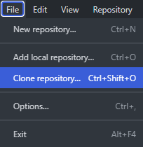
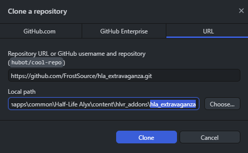
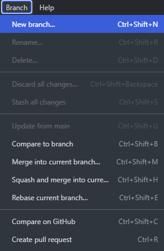
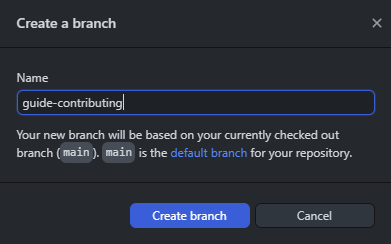
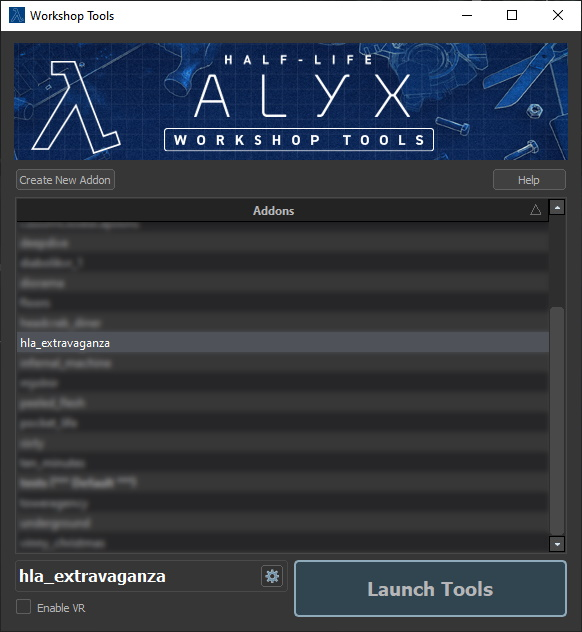
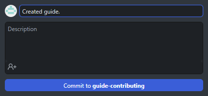
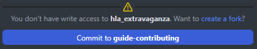
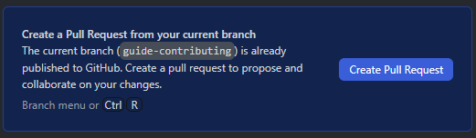

# Contributing assets

> This guide explains the process of submitting a contribution to us for users to download. Each submission should be on a separate branch and contain only the files necessary for that contribution. If you have multiple prefabs to submit you should do so individually.

> Make sure your contribution is unique and does not exist in some form already in the repository. If it does and you think you can improve the existing asset please modify it as part of your pull request instead of making a new asset. If it is a small change you can [open a new issue](https://github.com/FrostSource/hla_extravaganza/issues/new) for the asset instead.

> GitHub Desktop is used in this guide but you may use any method you prefer for interacting with Git.

---

[GitHub Desktop](https://desktop.github.com/) is a simple Git utility program useful for beginners. It will install the latest Git along with it.

Clone this repository (https://github.com/FrostSource/hla_extravaganza.git) to your own Half-Life: Alyx addons content directory, which is usually `C:\Program Files (x86)\SteamLibrary\steamapps\common\Half-Life Alyx\content\hlvr_addons\` using `Ctrl+Shift+O` or by going to `File>Clone repository...`

Create a branch from the master using `Ctrl+Shift+N` or by going to `Branch>New branch...`

This branch will be the one you use to work on your assets separately from the main branch. We use the following naming format for contributions but you are allowed to use any name as long as it is descriptive and distinct:

    asset_type-asset_title

Examples:

    prefab-keycard_reader
    guide-contributing

Open the Half-Life: Alyx workshop tools through Steam and launch the `hla_extravaganza` addon.

*If the addon is not present in the list you will need to `Create New Addon` with the same name as the addon folder for it to be recognized.*

Add/create your files within the relevant folders/subfolder.

Test/proof-read your contribution to make sure there are no bugs or missing text. If your contribution is a prefab or other non-markdown asset, make sure you also include a README.md file to explain how it works. You can grab a copy of a template README.md for your asset type from [the templates directory](../../templates/)

When your assets are complete and documented you can commit them to the current branch:

You will need to fork the repository because you won't have write access:

See https://docs.github.com/en/get-started/quickstart/fork-a-repo for more information about forking.

The last step here is to create a pull request for us to view and test:

You will be redirected to the pull request in your browser where you can add additional information that you think we should know when reviewing your submission. If everything is correct your contribution will eventually be accepted and made available to everyone.

---

If you have any trouble at all with the process of contributing don't hesitate to ask over [at the discord](https://discord.gg/yTQhGeKxSK).

