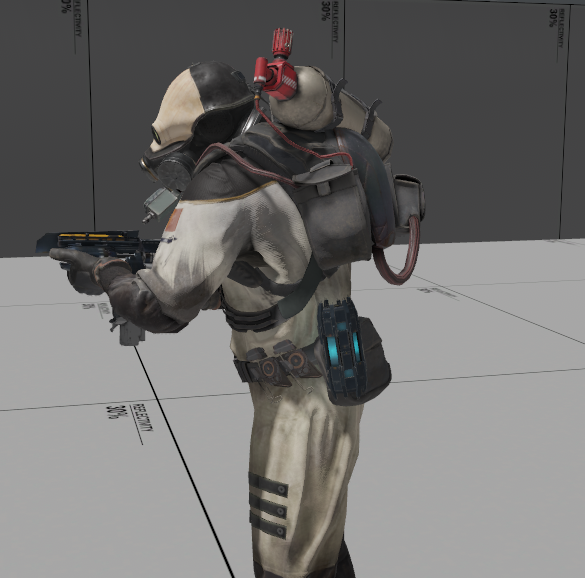

# ai_attached_item_manager

https://developer.valvesoftware.com/wiki/Ai_attached_item_manager

> ai_attached_item_manager is a [point entity](https://developer.valvesoftware.com/wiki/Point_entity) available in [Half-Life: Alyx](https://developer.valvesoftware.com/wiki/Half-Life:_Alyx). It attaches items such as ammo clips/mags or [health syringes](https://developer.valvesoftware.com/wiki/Item_healthvial) to ragdolls or enemies with attachment points on their models. You can attach items to [zombies](https://developer.valvesoftware.com/wiki/Npc_zombie_(hlvr)) (not including Jeff, or the blind zombie), barnacles, all types of Combine soldiers, and ragdolls of zombies and Combine.

> It is possible to add attachment points to custom models for this entity to use and is not limited to npcs/ragdolls, see [How attachment slots are chosen](#how-attachment-slots-are-chosen)

---

## Properties

|| Property | Raw | Description |
| -: | - | - | - |
|| Target(s) | `target` | This is the NPC(s) who's items this manager should be managing. May be a targetname or a classname.
|| Number of Attached Items | `num_attached_items` | The number of items attached to our target NPC(s). The NPC(s) will also need a matching number of attachment points on their model.
|| Item 1 | `item_1` | Class name of item to attach in slot 1. If set to Default, the NPC's code will decide what it should be, if anything.
|| Item 2 | `item_2` | Class name of item to attach in slot 2. If set to Default, the NPC's code will decide what it should be, if anything.
|| Item 3 | `item_3` | Class name of item to attach in slot 3. If set to Default, the NPC's code will decide what it should be, if anything.
|| Item 4 | `item_4` | Class name of item to attach in slot 4. If set to Default, the NPC's code will decide what it should be, if anything.
|| Listen to Entity Spawns | `listen_entityspawns` | If you want this manager to affect valid targets that are spawned after the manager, you need to set this. Most likely only needed if you want to target NPCs via a classname to catch all future spawns on that NPC type. It has a perf cost, so don't turn it on if you don't need it.
|| Item Removal Allowed for Ammo Balancing | `mark_as_removable` | 

---

## I/O

**N/A**

---

## How attachment slots are chosen

The manager will start by looking for the first exlusive attachment point for this item "item\_0\_*classname*" and attach the item. If the exclusive attachment point is found but already filled, it will look for the next one "item\_1\_*classname*" and so on.

If the above fails it will look for an "any" attachment for the current item number "item\_*x*\_*classname*" and attach the item.

If neither are found it will just move on to the next item without attaching this one.

For example, if we try to attach the following items
```
Frag Grenade
Energy Gun Clip
Health Vial
Rapidfire Clip
```
To a model with the following attachments
```
item_0_any
item_0_item_hlvr_grenade_frag
item_1_any
item_0_item_hlvr_clip_rapidfire
```
We will end up with the following item attachments
```
item_0_any - Nothing
item_0_item_hlvr_grenade_frag - Frag Grenade
item_1_any - Energy Gun Clip
item_3_item_hlvr_clip_rapidfire - Rapidfire Clip
```
The Health Vial was not attached because by the time the manager got to it at number 2 (counting starts at 0) there are no valid attachments for that number and no exclusive attachments for that class.

---

## Notes

If editing in raw edit mode you can specify any class name instead of choosing from the dropdown list, allowing you more freedom to attach items like `item_hlvr_prop_battery` 

Items can be attached to an entity multiple times (e.g. Spawning an item manager more than once) but the manager will not take into account currently attached items and will spawn on the first attachment it's allowed to.

---

## Creating custom attach points on a model

attachments with a class exclusive take priority over 'any' attachments. start the exclusive number after 0


