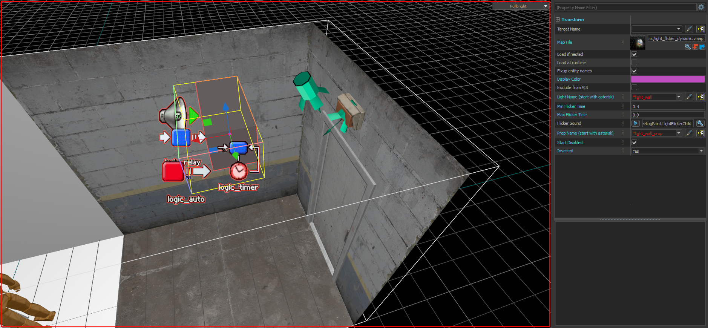

# Light Flicker Dynamic
by FrostSource

> ### Controls a chosen light and prop to flicker together providing a more realistic feel.

> A given light will have its brightness faded for each flicker.
> 
> A given prop will have its skin changed with `0` being off and `1` being on. Many base light props follow this rule but some do not. You can change the skin number that is chosen on flicker by editing or collapsing the prefab and changing the outputs for the `point_entity_finder` named `light_flicker_prop_find`.

---

## Assets required

- maps\prefabs\light_flicker_dynamic\light_flicker_dynamic.vmap

---

## Properties

| Property | Description |
| - | - |
| Light Name (start with asterisk) | The targetname of the light to affect but with a wildcard in front. If your light is called `light_flicker` you would enter `*light_flicker`. Because this uses the wildcard make sure your light name is unique from all others.
| Min Flicker Time | The minimum amount of seconds before the light can flicker again. Recommended to choose a value above 0.2.
| Max Flicker Time | The maximum amount of seconds before the light can flicker again.
| Flicker Sound | The sound that will play each time the light flickers.
| Prop Name (start with asterisk) | The targetname of the prop to affect but with a wildcard in front. If your prop is called `light_flicker_prop` you would enter `*light_flicker_prop`. Because this uses the wildcard make sure your light name is unique from all others.
| Start Disabled | If the prefab should not be flickering your entities on game start.
| Inverted | By default the prefab will flicker turn your entities on for a moment each time a flicker occurs, meaning your light will be off most of the time or when disabled. Set this property to `Yes` if you want your entities to start on and flicker off.

---

## Input / Output

|| Name | Description |
| -: | - | - |
| **Inputs**
|| inputKill | Kills all entities in the prefab.
|| inputDisable | Disables the prefab from flickering the entities.
|| inputEnable | Enables the prefab to flicker the entities.
| **Outputs**
|| outputFlicker | Outputs when the prefab is randomly triggering the entities to flicker.

---

## Images

---
---
---

# Light Flicker Dynamic

> ### Controls a chosen light and prop to flicker together providing a more realistic feel.

> A given light will have its brightness faded for each flicker.
> 
> A given prop will have its skin changed with `0` being off and `1` being on. Many base light props follow this rule but some do not. You can change the skin number that is chosen on flicker by editing or collapsing the prefab and changing the outputs for the `point_entity_finder` named `light_flicker_prop_find`.

---

## Assets required

- maps\prefabs\light_flicker_dynamic\light_flicker_dynamic.vmap

---

## Properties

- Light Name (start with asterisk)

    The targetname of the light to affect but with a wildcard in front. If your light is called `light_flicker` you would enter `*light_flicker`. Because this uses the wildcard make sure your light name is unique from all others.

- Min Flicker Time

    The minimum amount of seconds before the light can flicker again. Recommended to choose a value above 0.2.

- Max Flicker Time

    The maximum amount of seconds before the light can flicker again.

- Flicker Sound

    The sound that will play each time the light flickers.

- Prop Name (start with asterisk)

    The targetname of the prop to affect but with a wildcard in front. If your prop is called `light_flicker_prop` you would enter `*light_flicker_prop`. Because this uses the wildcard make sure your light name is unique from all others.

- Start Disabled

    If the prefab should not be flickering your entities on game start.

- Inverted

    By default the prefab will flicker turn your entities on for a moment each time a flicker occurs, meaning your light will be off most of the time or when disabled. Set this property to `Yes` if you want your entities to start on and flicker off.

---

## Input / Output

- outputFlicker

    Outputs when the prefab is randomly triggering the entities to flicker.

- inputKill

    Kills all entities in the prefab.

- inputDisable

    Disables the prefab from flickering the entities.

- inputEnable

    Enables the prefab to flicker the entities.

---

## Images

