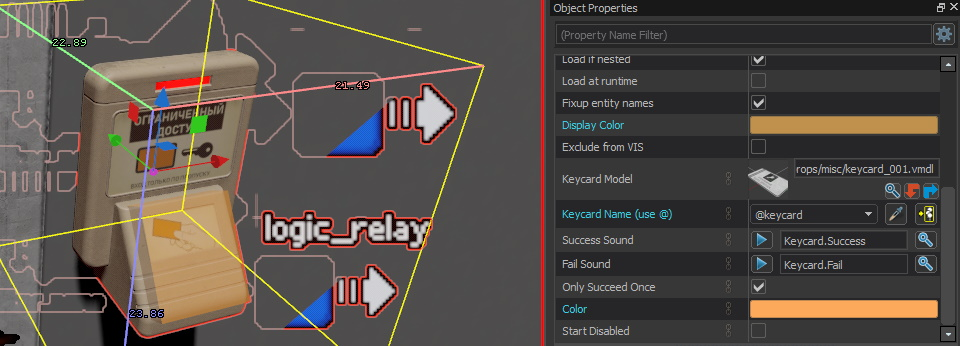

# Keycard Reader
by FrostSource

> ### A working keycard reader like the ones found in the base game.

---

## Assets required

- maps\prefabs\gameplay\keycard_reader.vmap

---

## Properties

| Property | Description |
| - | - |
| Keycard Model | The model that will be registered as a keycard by the reader. Any other models that pass over the scanner will be ignored.
| Keycard Name (use @) | Targetname of the entity that will successfully activate this keycard reader.
| Success Sound | Sound to play when the correct entity is placed on the scanner.
| Fail Sound | Sound to play when an incorrect entity is placed on the scanner.
| Only Succeed Once | If ticked, once the keycard reader is successfully activated it will no longer accept any input.
| Color | Color of scanner model.
| Start Disabled | Keycard reader will not accept input until enabled via I/O input.

---

## Input / Output

|| Name | Description |
| -: | - | - |
| **Inputs**
|| Enable | Enables keycard input.
|| Disable | Disables keycard input.
| **Outputs**
|| OnSuccess | Fires when the correct keycard is scanned. This will fire every time unless `Only Succeed Once` is ticked.
|| OnFail | Fires when an incorrect keycard is scanned.

---

## Images

