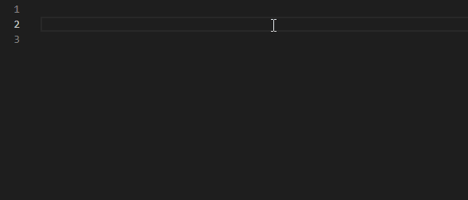
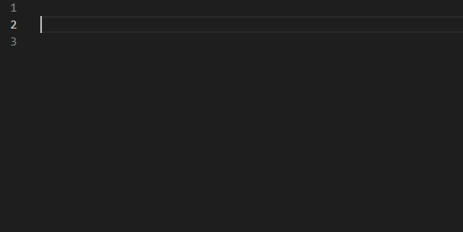

# .vscode

`.vscode` is the folder at the root of your VS Code workspace where settings and snippets are stored (you can read more about this at https://code.visualstudio.com/docs/getstarted/settings).

## vlua_snippets.code-snippets

Provides snippets for base Alyx features:

7 hook functions `Activate`, `OnBreak`, `OnEntText`, `OnTakeDamage`, `Precache`, `Spawn`, `UpdateOnRemove`

3 trace functions `TraceLine`, `TraceHull`, `TraceCollideable`

## extravaganza.code-snippets

Provides snippets for non standard code or code using features provided through a library not included with Alyx by default.

## settings.json

Provides recommended settings for working with Lua files for Alyx. You must have the [Lua Language Server](https://marketplace.visualstudio.com/items?itemName=sumneko.lua) extension installed for these settings to work.
