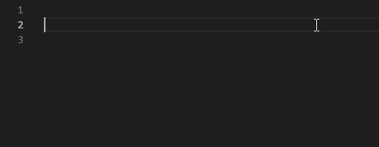

# Scripts

> This collection includes stand alone scripts and scripts used in conjunction with prefabs and other assets. See the individual script header for information about how the script is used.

---

## vlua_globals.lua

### What is it?

This file is for use with [Visual Studio Code](https://code.visualstudio.com/) and the [Lua Language Server](https://marketplace.visualstudio.com/items?itemName=sumneko.lua), improving intellisense by declaring all known Lua functions specific to Half-Life: Alyx into the global scope. It is purely for helping with the coding process and does not introduce or modify any functionality in-game.

### Why use it?

If you've written a script in VS Code for Alyx you might be familiar with warnings about unknown names and types.


`vlua_globals.lua` fixes these issues and provides full code completion for known functions and methods, including descriptions and type hinting. This dramatically improves the coding process allowing you to focus on writing the script instead of looking up function definitions or double checking if a warning is legitimate.




### Installation

Copy the `vlua_globals.lua` file anywhere within your VS Code workspace. It is often placed in the root of your scripts folder, e.g.

    game\hlvr_addons\my_addon\scripts\

As long as the editor knows about this file it should assume its contents belong in the global scope, even though this file will never be executed. If you are using Git and are having issues with `vlua_globals.lua` not being recognized, make sure it is **not** excluded via .gitignore.

*More information is included in the header of the script itself.*


# Entity Classes

> This is only a very basic rundown of entity classes as they are still in development and subject to changes. A more complete tutorial will be provided when the system is closer to being feature complete.

This document will guide you through our class system which has been designed to work with the [Lua Language Server](https://github.com/LuaLS/lua-language-server) to provide accurate code completion. It also allows for a straightforward inheritance mechanism, automatic variable saving, and a multitude of other useful features.

To create an entity, you can use the `entity()` function. This global function constructs a base table which will become the metatable of an entity table. The syntax of the function is as follows:

```lua
entity(name_of_new_class, [any_extension_classes, ...])
```

When the function is called: The base class table is created. If any previously defined classes are supplied as extensions, they are added to the class's `__inherits` field which is an ordered table of classes. The class is then assigned a metatable with an `__index` metamethod that searches all `__inherits` for a given key when the user tries to retrieve its value.

If the `entity()` is called from an environment that contains `thisEntity`, the function will assume that it's being created for that entity and will automatically inherit the new class table.

The function returns:
- The class table itself
- "self" if it was defined in an entity environment
- The first extension class table if any were provided (in the future, this single-only extension return limitation will be removed).

### The basic initialization line for a class is as follows:

```lua
---@class MyClass
local base, self, super = entity("MyClass")
```

- `---@class MyClass` is Lua Language Server's way to defining a class and associating it with the next variable `base`. This is how we get code completion.
- `base` holds the class table that is returned by `entity` and will be what we define functions and fields on.
- `self` will be the same as thisEntity if this script is attached to an entity, otherwise it will be nil.
- `super` holds the first extension class if any are provided, which none were in the example line.
- `entity("MyClass")` we define a name so the class system can keep track of it for later use (inheritence, type checking). It's not technically required and the system will generate a unique name it is omitted, but strongly recommended.

### Basic Setup:

To define members for the class we use the returned `base` class table:

```lua
---@class MyClass
local base = entity("MyClass")

base.myNumberField = 1

function base:MyAddMethod(num)
    self.myNumberField = self.myNumberField + num
end

function base:OnReady(loaded)
    print("Before: " .. self.myNumberField)
    self:MyAddMethod(100)
    print("After: " .. self.myNumberField)
    print("Base: " .. base.myNumberField)
end

return base
```

The first thing to point out is that we have removed the `self` declaration from the entity returns as this will be an example of creating a class that will be inherited later.

- `base.myNumberField = 1` we declare a new field and assign a number. it's important to always define class members on the `base` table and NOT the `self` table.
- `function base:MyAddMethod(num)` we use colon notation instead of dot notation to show that this function will implicitly have a `self` variable that references the table that called the function. We can work with dot notation but you have to supply your own self parameter.
- `self.myNumberField = self.myNumberField + num` inside the method we use `self` instead of base we want to reference the table that called the function (the table is usually the entity). The first time this line is executed the system will look for `myNumberField` on the entity and since it doesn't exist it will fall back to the inherited class and find it there with a value of `1`. After adding `num` to `1` it will then assign it to a field called `myNumberField` on the entity itself and any future lookups will find it there. This way the base field is untouched and does not interfere with future entities inheriting this class.
- `base:OnReady(loaded)` OnReady is one of the many special methods that classes have and are usually related to entity "hooks". This one in particular is called during the "Activate" hook but the system uses the hook to give extra built-in functionality like automatic thinking/saving. `loaded` is a boolean refering to whether the game was started from a saved game load or a new game.

    Inside the function you can see an example of how we reference fields and call methods. The last line shows how to reference the unchanged base value for the field. This can also be modified if desired and will be reflected across other instances that haven't assigned a value to the field.

- `return base` while not required it is good convention to always return the base class in case it will be loaded using the `require` method as shown below.

### Extentions/inheritence:

You can extend classes too allowing you to keep all your code in one place while still sharing it to the classes that need it:

```lua
---@class MyClassExtended : MyClass
local base, self, super = entity("MyClassExtended", "MyClass")

function base:MyMultiplyMethod(value)
    self.myNumberField = self.myNumberField * value
end

function base:OnReady(loaded)
    super.OnReady(self, loaded)
    print("Before multiply: " .. self.myNumberField)
    self:MyMultiplyMethod(2)
    print("After multiply: " .. self.myNumberField)
end

return base
```

- `---@class MyClassExtended : MyClass` This is Lua Language Server's method of inheritence. This is for code completion.
- `local base, self, super` since we are inheriting a class we can also take advantage of the `super` return which is the table of the inherited class `MyClass`. `super` is the same value as `base` from the previous script example, the new `base` we've defined here is for `MyClassExtended`.
- `entity("MyClassExtended", "MyClass")` we define a name for our class as before but this time we use a second argument to tell the function we want to inherit the previous defined `MyClass`. There are other way to use this argument that will be shown at the end of this section.

We define a new method that takes advantage of the field defined in the parent class.

- `base:OnReady(loaded)` an example of overriding methods. Both classes have this method but since this class is closer to the entity in the inheritence chain it will be chosen first.
- `super.OnReady(self, loaded)` since we have access to the super class `MyClass` we can still call its original method if we want to retain the functionality. We have to use the slightly different dot notation here and pass `self` ourselves plus any other parameters.

There are three main ways to tell the system which script you want to inherit depending on how your codebase is set up:

```lua
-- Traditional way by giving it the defined name. This requires that the script defining "MyClass" is executed before this script.
local base, self, super = entity("MyClassExtended", "MyClass")


-- You can cache the class table in a global variable and pass it directly.
local base = entity("MyClass")
MyClass = base
local base, self, super = entity("MyClassExtended", MyClass)

-- You can provide a path to the Lua script file allowing the system to 'require' it automatically. This is why we have `return base` at the end of scripts to support this functionality.
-- Assuming your script has the folder structure "scripts/vscripts/myclasses/myclass.lua"
local base, self, super = entity("MyClassExtended", "myclasses.myclass")

-- You can also require it yourself as you're passing it. This is essentially the same as method 2.
local base, self, super = entity("MyClassExtended", require("myclasses.myclass"))
```

You can inherit as many classes as you want and they don't have to be strictly linked; you might have a "Health" class that is used by both NPC and physics prop classes.
```lua
entity("MyClassExtended", "MyClass", "MyClass2", "MyClass3", ...etc)
```


inherit() attaches an existing class to an entity by moving the existing metatable assigned by Valve to an __inherits list alongside the class table. This way when searching for a function or variable the engine will first search Valve's entity metatable and then the custom class (and any extension classes beyond).
(Plans to allow Valve function overrides are in the works)

Inheritence scripts are very simple but similar to class scripts:

```lua
local base, self = inherit("MyClassExtended")
if self and self.Initiated then return end
```

- `local base, self` you usually don't need access to these in entity inheritence scripts but they are there if you find a good use.
- `inherit("MyClassExtended")` currently you can only inherit one class to an entity but this will be resolved later. The same rules apply as with inheritence in `entity`, you can supply a name, script path, or direct table.
- `if self and self.Initiated then return end` Initiated is a special field defined on all class entities. It's used to stop code being executed twice on a game load which is something that occurs for unknown reasons.

### Special class members

```lua
---Called during the Activate hook. Any changes to variables in this function are automatically saved.
---@param loaded boolean # true if the game was loaded from a save, false otherwise
function base:OnReady(loaded)
end

---Currently works exactly like the Spawn hook.
function base:OnSpawn(spawnkeys)
end

---Currently works exactly like the UpdateOnRemove hook.
function base:UpdateOnRemove()
end

---Currently works exactly like the OnBreak hook.
function base:OnBreak(inflictor)
end

---Currently works exactly like the OnTakeDamage hook.
function OnTakeDamage(damageTable)
end

---Currently works exactly like the Precache hook.
function Precache(context)
end

---The main entity think function which is started with "self:ResumeThink()" and stopped with "self:PauseThink()".
---If the game was saved and loaded while the entity is thinking it will automatically start thinking again.
function base:Think()
end

---Assign a new value to entity's field `name` and saves it.
---This is shorthand for assignment+save.
---This is likely to be deprecated when automatic saving upon assignment is introduced.
---@param name string
---@param value any
self:Set(name, value)

---Save a given entity field. Call with no arguments to save all data.
---This is likely to be deprecated when automatic saving upon assignment is introduced.
---@param name? string # Name of the field to save.
---@param value? any # Value to save. If not provided the value will be retrieved from the field with the same `name`.
self:Save(name, value)

---Resume/start the entity think function. Must have "base:Think()" defined.
self:ResumeThink()

---Pause/stop the entity think function. Must have "base:Think()" defined.
self:PauseThink()

---Is false when the class is created, becomes true when the Activate hook finishes.
---Used to stop scripts running all the way through on game load.
self.Initiated = false

---True if the entity is thinking with its main think function "base:Think()", and only if it was started using "self:ResumeThink()".
self.IsThinking = false
```

### Notes

Because of the way class scripts work you should only use `local` variables for constant values. `local` variables will be shared by entities because they belong to the class script itself, not the instance that inherits the class script. This means any changes to local variables will ripple through all instances.

If you have a class field that needs to change but doesn't need to be saved across play sessions, you can prefix it with double underscores "__":

```lua
self.__unsavedVariable
```

If you want to check the inheritance of an entity you can use the `isinstance()` global function:

```lua
local _, self = inherit("MyClassExtended")

print(isinstance(self, "MyClassExtended")) -- true
print(isinstance(self, "MyClass")) -- true
```
`isinstance()` will accept either a string name or class table.